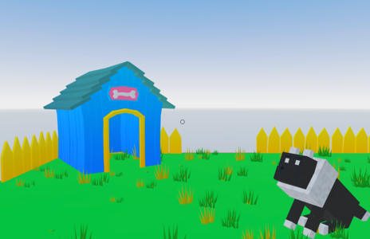

# Block Dog

A scene with a simple AI character. It randomly chooses what action to take: follow you, sit or remain idle. You can also tell it to sit or stand up by clicking it, or tell it to drink water by clicking its bowl.



This scene shows you:

- How to handle multple animations on a 3D model
- How to create a basic AI, giving an NPC a basic state-machine behavior
- How to use randomness to determine autonomous behavior of a character
- How to override random behaviour with specific commands
- How to make an entity follow the player's position


## Try it out

**Install the CLI**

Download and install the Decentraland CLI by running the following command:

```bash
npm i -g decentraland
```

**Previewing the scene**

Download this example and navigate to its directory, then run:

```
$:  dcl start
```

Any dependencies are installed and then the CLI opens the scene in a new browser tab.

**Scene Usage**

- The dog has autonomous behavior and randomly sits and stands up on its own.
- If you click the dog, it switches from standing up to sitting down.
- If you click the water bowl, it walks towards it and drinks.
- If you step inside the bounds of the scene, the dog follows you and sits in front of you.

Learn more about how to build your own scenes in our [documentation](https://docs.decentraland.org/) site.

If something doesn’t work, please [file an issue](https://github.com/decentraland-scenes/Awesome-Repository/issues/new).

## Copyright info

This scene is protected with a standard Apache 2 licence. See the terms and conditions in the [LICENSE](/LICENSE) file.
